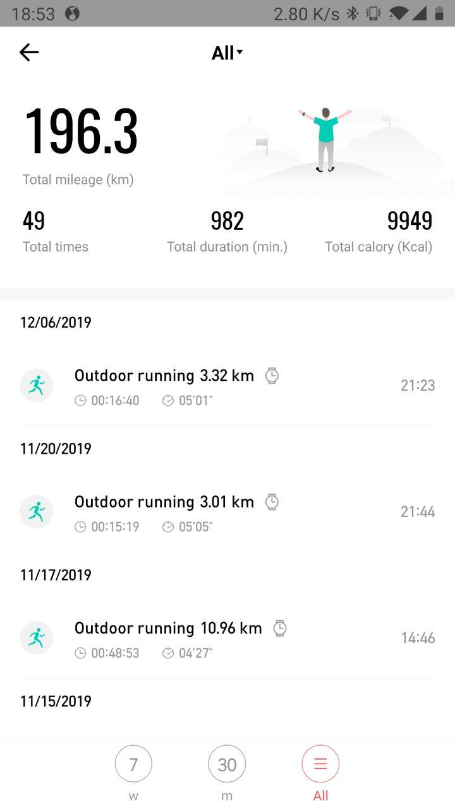
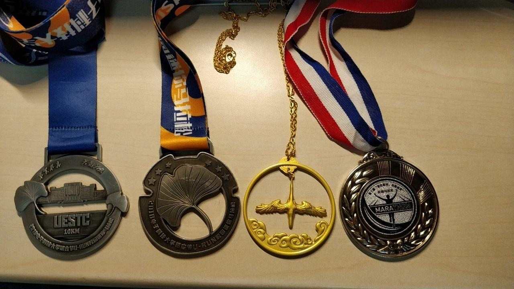
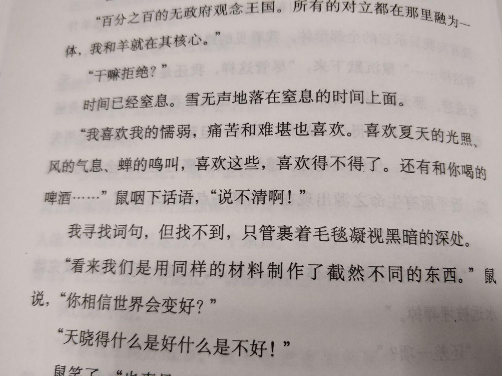
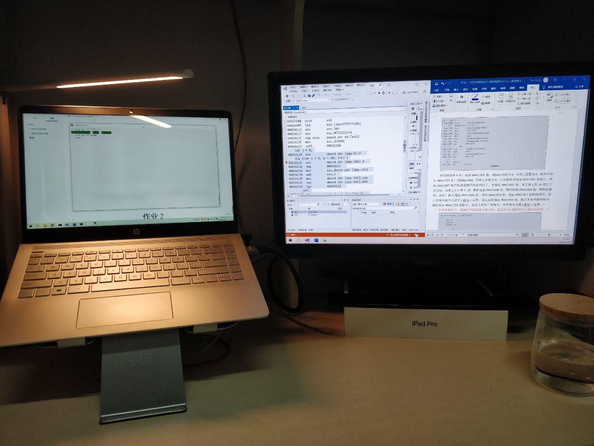

21 世纪的 10 年代就这么结束了。过得好快，好像什么也没有做过一年就完了，回头看看似乎还是做了不少的事。

## 跑步

~~去年~~ 2018 年开始练习并爱上跑步（还没有切换过来🤣），但是 2018 年太懒了，跑得太少，更谈不上练习。2019 年算是开始认真练习的第一年吧。大概是 6 月份的时候买了 Amazifit 的手表，之后跑步的都是用手表记录了。2019 年总共可能跑了有 250 km，这个距离不算长，还不能从成都跑回我家呢。但是我还是挺满意的，毕竟我开始了，开始了认真的练习。

先来一张马拉松的奖牌合影（我好像除了马拉松就没有别的什么奖牌了😅）。

今年第一场马拉松是『金温江马拉松 10 km 』，算是我第一次参加比较正式的马拉松吧。

比赛的前几天一直下着大雨，还夹杂这不小的风，我去领参赛包的时候全身都湿透了。我还担心跑步那天也会下雨。幸运的是，比赛那天风和日丽，虽然跑到后面太阳有一点点晒。这其实是我第一次跑 10 km，平时练习跑步都只会跑 5 km。跑前还担心自己会跑不下来，结果成绩还不错，净成绩：46 分 36 秒。

这次马拉松给了我不少信心，之前觉得自己只能自己跑着玩玩，从来没有想到我还能跑出不错的成绩（其实很一般的成绩，只是我很满意啦）。

6 月份有一次校园马拉松，5 km。但是那天状态不好，跑到一半的时候肚子疼，最后成绩：25 分 47 秒。

2019 银杏节校园马拉松，我参加了 10 km。我觉得校园马拉松的总长度不止 10 km，我的手表测出来大概有 11 km。最后成绩：48 分 48 秒。全校排第 12 名，我还是比较满意了。

希望今年再接再厉，争取上半年跑一次半马，后半年参加一次全马。我觉得自己现在还是太瘦弱了，很多关键肌肉还没有练好，要完成这个目标还要很多的练习。今年要制定更加具体的练习计划，增加练习量，科学练习。期待今年在跑步方面取得更好的成绩。

我一直在想为什么我喜欢上了跑步。最开始跑步是因为 2018 年有段时间太丧了，希望可以通过跑步让自己振作一些。在昏黄的路灯和惨淡的月光的见证下，我不知道绕着学校的环湖跑道跑了多少圈。湖水泛出的鱼腥味，刚割过的草坪的味道，有时还有刚开出的花的清香，夹杂在一起，就和我当时心境一样复杂，分不清是好闻还是臭。跑完步，衣服已经被汗水浸湿，身体也疲惫不堪，心情该怎样丧还是怎样丧。我不觉得跑步陪我走过了那段不开心的时光。但是我还是喜欢上了跑步。喜欢每一次脚与地面的亲密接触，喜欢急促的呼吸，也喜欢那种不断移动的感觉。

## 读书

先说村上。2019 年，读了 6 本村上的小说，一本访谈，一本随笔，一本短篇集。我觉得今年读到的最好的是《奇鸟行状录》。一言两语说不清这本书，总之我觉得它可能是村上最好的作品吧。最让我惊喜的是前段时间刚读完的《寻羊冒险记》，可以很明显地看出从《且听风吟》，《1973 年的弹子球》之后，村上的创作开始变得成熟。这本书剧情第一次变得有些复杂了，而且这书很有钱德勒的味道。

2019 年我读到的最优秀的作品 ——《卡拉马夫兄弟》。这本书最让我震撼的是陀思妥耶夫斯基真的做到了描绘人性的全部深度，不愧鲁迅说的『人类灵魂的伟大的审问者』（这话鲁迅真说过）。除了对人性的深刻剖析，这本书中对宗教，信仰，俄罗斯社会的讨论也相当精彩。

2019 年最让我感到惊喜的作品 ——《别让我走》。读这本书有一种让我找回了童年时期读书的那种感受。童年读书是什么感受呢：跟着主人公一起笑，一起哭，感动他（她）的感动，悲伤他（她）的悲伤。这本书给我很强的代入感，温柔却又残忍。书的结构也很有趣，像一个洋葱一样，一层一层地剥开，把残忍的真相一点一点地揭露。

2019 年又重读了一遍《Norwegian Wood》，这次读的是英文版。每一次读都很感动吧，大概以后这本书是我的必修吧，每年都会拿出来读一读。读了不少书，渐渐发现了很多比《挪威的森林》优秀的书，但是一点也没有冲淡我对她的喜欢啊。可能就像爱一个人那种感觉，虽然看到了更多漂亮的女孩，但是还是喜欢那一个和我心灵契合的人。

## 写代码

这个 Github 的年度报告不准确，我怎么可能只写了这么一些代码。

2019 年最让我心烦的就是代码问题了。感觉自己做了很多无用工，写了很多没有用但是又不得不写的代码，想要做的事却一件都没有做好。不过应该还是有很多看不到的提升吧，毕竟累计了这么多的量。

希望今年 Github 的贡献记录上，我是一片『绿』，哈哈。

## 找寻

2019 对我来说是找寻的一年。我开始尝试各种各样的新事物，认识新的朋友，做以前不喜欢的事。怎么说好呢？感觉自己的心境变地开阔了。以前是在峡谷之中，只看得到头顶上一条缝的天空。现在我在开阔的大草原上，一望无际的草坪在远处和蓝天交连。从前在峡谷中，我只能一股老地往前冲，现在我看到了无限的可能，四面八方都是美好的风景。

在峡谷中前进，我不需要考虑方向，但是现在我要考虑方向了。我开始思考很多以前没有怎么想过的问题。比如人生的意义，世界的本质等。很多问题都没有想明白，但是好像世界上也没有几个人能真正想通吧。这个思考的过程像是找寻的过程。这个寻找可能也是我一辈子的寻找吧。没有终点，彼岸的彼岸仍然是彼岸。人活着或许就应该找寻些什么吧，《寻羊冒险记》中的羊博士就一直找寻着羊，即便是最终没有找到还是要不断地找下去。

我其实挺喜欢这种找寻什么的感觉，有一种永远在路上的感觉。虽然不知道有没有终点，也不知道方向是否正确，但是仅仅是这种找寻的感觉就能给我无限的踏实感。

## 放弃

记得小学的时候写一篇半命题作文：『我选择 ... 』，我当时写的是『我选择放弃』。老师说这篇作文在老师改卷的时候备受好评，之后还在全班读了这篇作文。现在才明白当时那个小屁孩写的『放弃』是多么的泛泛之论，说的多么轻松。

如今，我真的必须选择放弃了。如今才知道从前轻轻谈起的『放弃』，是多么艰难，是需要多大的勇气。真的放弃是很痛的吧。不过我都接受了。我不能站在原地，看着整个世界都在往前走，而我却停滞不前吧。我得勇敢地向前啊！谁也不知道，我是积累了多少的勇气才能选择放弃。但是，我还是选择了放弃；选择不再安于现状、委屈求全；选择承认自己浪费了两年的青春；选择勇敢地去拥抱自己的未来。

---

最后用一首最近很喜欢的诗来结束吧。

> 去什么地方呢？这么晚了，
>
> 美丽的火车，孤独的火车？
>
> 凄苦是你汽笛的声音，
>
> 令人记起了许多事情。
>
> 为什么我不该挥舞手巾呢？
>
> 乘客多少都跟我有亲。
>
> 去吧，但愿你一路平安，
>
> 桥都坚固，隧道都光明。
>
> <cite>塔朗吉 《火车》</cite>

喜欢这种踏实的感觉啊，像夏日的光照，风的气息，蝉的鸣叫。

希望 2020 的桥都坚固，隧道都光明。
