class: middle, center
# 事务处理

### 基于 MVCC 的乐观事务处理
.pull-right.footnote[杨韬]

---

## Table of Contents
- Transactions
- Serializability
- Concurrency Control
  - Timestamp Ordering
  - Validation
  - Multi-Version
  - MVTO
  - MVOCC

---

## Transactions

**事务**: 一系列数据库操作的逻辑单元。

--

### 事务的特性（ACID）

- 原子性 （atomicity）

  事务中的操作要么全都被执行，要么都没有被执行。

- 一致性（consitency）

  一个事务的前后，数据库从一个一致状态转移到另一个一致状态。

- 隔离性（isolation）

  事务之间是互不干涉的。对于某个事务而言，好像它占用了所有资源在独立运行一样。

- 持久性（durability）

  一个事务提交之后，它对数据库的改变是持久的。

---

layout: true
## 页模型（Page Model）

---

$D$ : 数据项集合

$w(x)$ : 写数据项 $x$

$r(x)$ : 读数据项 $x$

事务 T 可以表示为：

$T = \\{p_1, ..., p_i, ..., p_n\\} \ where \ x \in D, p_i \in \\{w(x), r(x)\\}$

---

.left-column[
### Example #1 update loss
]

.right-column[
事务 T 给 x 加上 100，$T = r(x)w(x)$

事务 U 给 x 加上 10，$U = r(x)w(x)$
]

--

.right-column[
| T        | U       |        x |
| -------- | ------- | -------: |
| r(x)     |         |       10 |
| x:=x+100 |         |          |
|          | r(x)    |       10 |
|          | x:=x+10 |          |
| w(x)     |         |      110 |
|          | w(x)    | .red[20] |
]

---

layout: true

## Serializability

---

> Concurrently executing transactions see the stored information as if they were running serially (one after another).
> .right[Jim Gray]

**可串行化（serializability）**：a transaction schedule is serializable if its outcome is equal to
the outcome of its transactions executed serially.

--

count: false
.center[**可串行化的调度可以保证并行执行的事务的隔离性**]

---

### Conflicts

Two actions of different transactions conflict, only if
1. They Involve the same database element, and
2. At least one is a write.

Two schedules are ***conflict-equivalent*** if they can be turned one into the other by a sequence
of non-conflicting swap of adjacent actions.

---

### Conflicts

$$T = r(x)w(y), \ U = w(x)r(y)$$

- $S_1 = r_T(x)w_U(x)w_T(y)r_U(y)$ is conflict-equivalent to execute T, U serially.

- $S_2 = w_U(x)r_T(x)r_U(y)w_T(y)$ is conflict-equivalent to execute U, T serially.

???
TODO: add figure
???

---

### Conflict-Serializability

A schedule is ***conflict-serializable*** if it is *conflict-equivalent* to a serial schedule.

- Conflict-serializability 保证了冲突行为在并发执行中的顺序和顺序执行中的顺序相同。

- Conflict-serializability 是一个比 serializability 更强的概念。

---

### Conflict-Serializability

$$T = r(x)w(y), \ U = w(x)r(y)$$

- $S_1 = r_T(x)w_U(x)w_T(y)r_U(y)$ is conflict-serializable.

- $S_2 = w_U(x)r_T(x)w_T(y)r_U(y)$ is not conflict-serializable.

???
TODO: add figure
???

---

layout: false

## Concurrency Control

- 悲观：利用锁阻塞数据的访问，以此保证冲突行为的执行的相对顺序一样。

- 乐观：假设没有冲突行为，直到发生违背了可串行化的情况，再来修复。
  - Timestamp Ordering
  - Validation (OCC: Optimistic Concurrency Control)

- Multi-Version
  - MVTO
  - MVOCC

---

layout: true
## Timestamp Ordering

---

每个事务 $T_i$ 被分配一个.red[唯一]的固定的时间戳 $TS(T_i)$。

如果 $TS(T_i) \lt TS(T_j)$，那么事务的调度必须等效于 $T_i$ 在 $T_j$ 之前执行。

**Timestamp**:

- System Clock.
- Logical Counter.

某个数据项上的最后一次 read/write 的.red[事务的时间戳]被标记在该数据项上：

- $WT(x)$ – Write timestamp on $x$
- $RT(x)$ – Read timestamp on $x$

---

**Reads**

对于事务 T 中的 $r(x)$:

- $TS(T) \lt WT(x)$: *read too late*，终止 T，给 T 分配一个新的时间戳并重启

    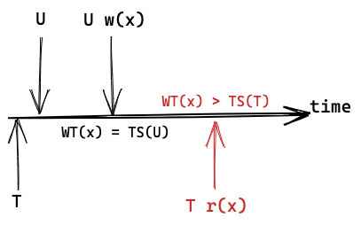

- otherwise: 执行 $r(x)$，$RT(x)=max(RT(x),\ TS(T))$

---

**Writes**

对于事务 $T$ 中的 $w(x)$:
-  $TS(T) \lt RT(x)\ or \ TS(T) \lt WT(x)$: write too late, abort and restart T

    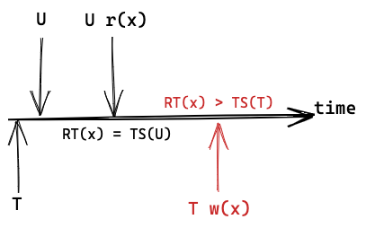

-  otherwise: 执行 $w(x)$，$WT(x) = TS(T)$

---

.left-column-top[
### Example #2 update loss
]
.right-column-top[
$T=r(y)w(x)$

$U=r(y)w(x)$
]

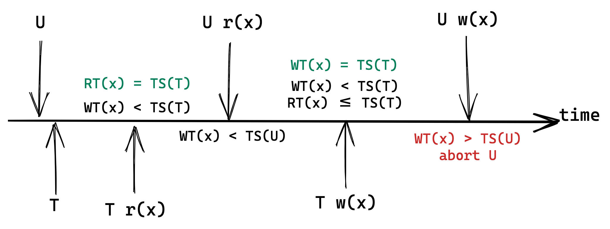

---

### Example #3 dirty read

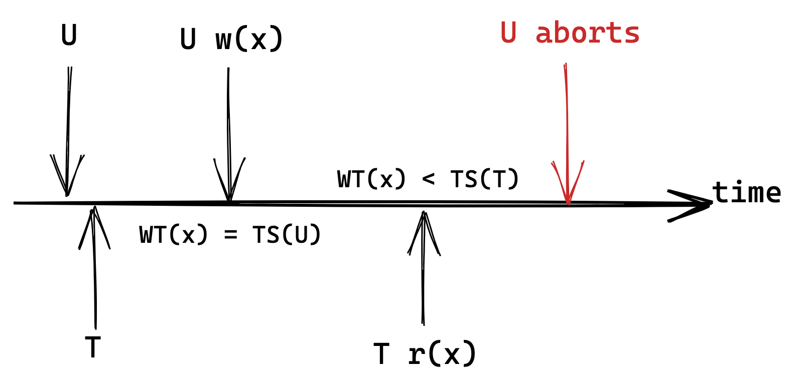

--

每个数据项 x 增加一个 commit bit —— $c(x)$ 表示最后写 x 的事务是否提交。
对于事务 T 的 $r(x)$， 如果 $TS(T) \ge WT(x)$:
 - $c(x)==false$ (uncommitted)：阻塞 T 的执行，直到 $c(x) == true$，或者写 x 的事务终止。
 - otherwise：执行 r(x)

---

### Example #4 repeated read

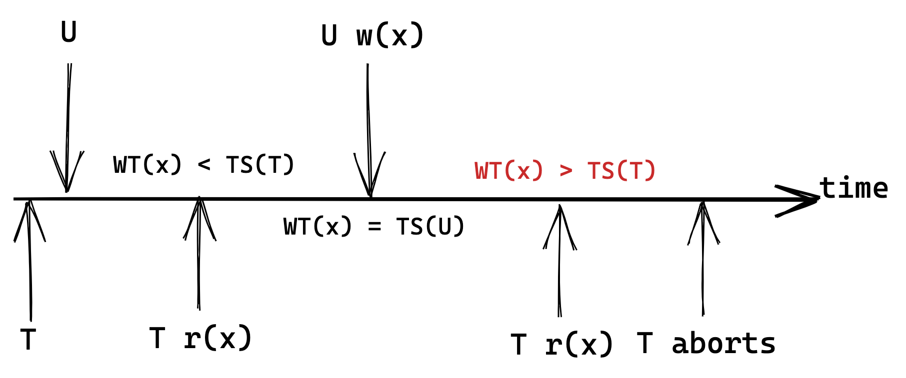

--

每次成功的 r(x)/w(x) 会创建一个 x 的副本，保存在事务的私有空间中。
之后的 r(x) 会直接返回事务私有空间中的值。

---

### Thomas Write Rule

对于事务 $T$ 中的 $w(x)$:
-  $TS(T) \lt RT(x)$，或者 $TS(T) \lt WT(x) \ and \ c(x) == false$ : write too late, abort and restart T.

-  $TS(T) \lt WT(x) \ and \ c(x) == true$: 根据 Thomas Write Rule，忽略 $w(x)$，继续执行 T 中其他操作。

-  otherwise: 执行 $w(x)$，$WT(x) = TS(T)$, $c(x)=false$

---

layout: true
## Validation

---

The system creates a private workspace for each transaction.

- Any object read is copied into workspace.

- Writes are applied to workspace.

When a txn commits, the system compares workspace write set to see whether it conflicts with other transactions.

If there are no conflicts, the write set is installed into the "global" database.

--

只有在事务提交后，该事务对数据库的改变对其他事务才可见。也就是说，一个事务读到的内容一定是已提交的.

---

### Phases

- **Read**:

  Read from the database all the elements in its read set and store its writes the private workspace.

--

- **Validate**:

   The scheduler checks if the transaction conflicts with other transactions.

   If validation fails, abort and restart the transaction.

--

- **Write**:

    Apply private change to database.

---

$WS(T)$: *write set* of T

$RS(T)$: *read set* of T

$START(T)$: T 开始的时间点

$VAL(T)$: T 开始 validation 的时间点

$FIN(T)$: T write 阶段结束的时间点

Validation 的目标：
- 如果 $VAL(T_i) < VAL(T_j)$，那么两个事务对数据库的改变应该等效于 $T_i$ 先与 $T_j$ 执行。

---

$VAL(U) < VAL(T)$

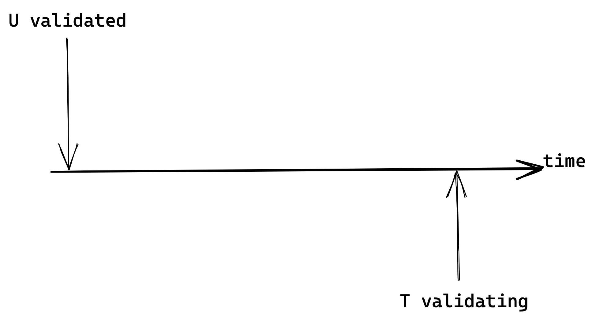

---

$VAL(U) < VAL(T) \ and \ FIN(U) < START(T)$

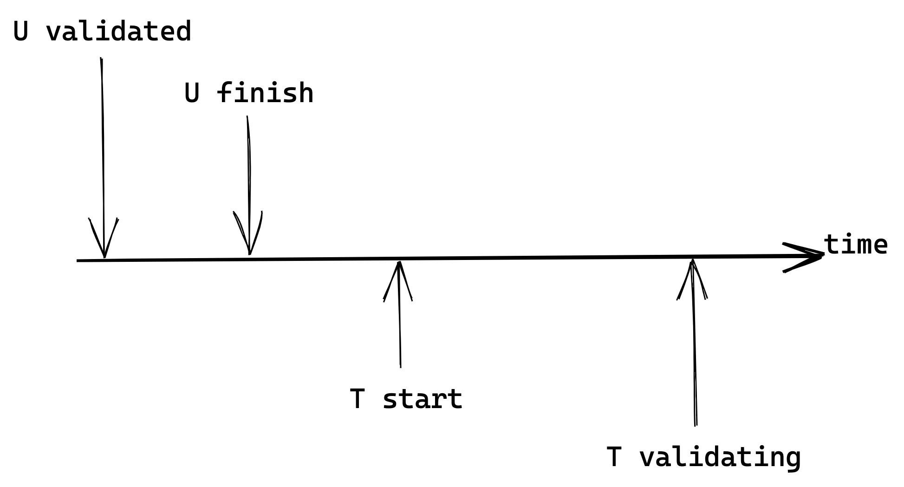

--

.center.red[No conflicts!]

---

$VAL(U) < VAL(T) \ and \ FIN(U) > START(T)$

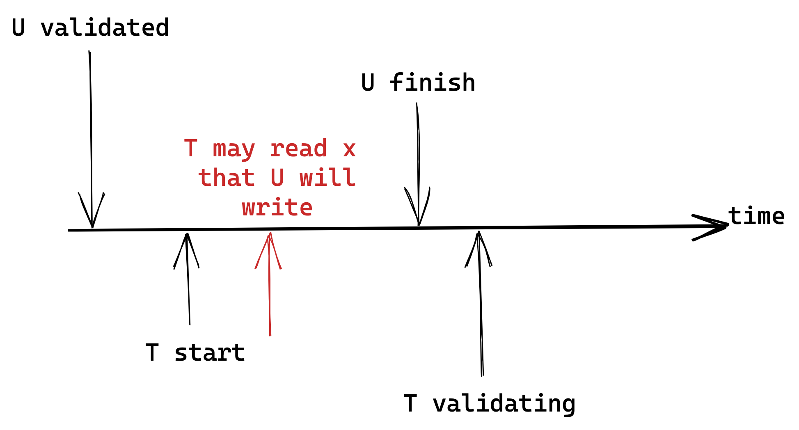

--

.red[
$$WS(U) \cap RS(T) = \emptyset$$
]

---

$VAL(U) < VAL(T) \ and \ FIN(U) > VAL(T)$

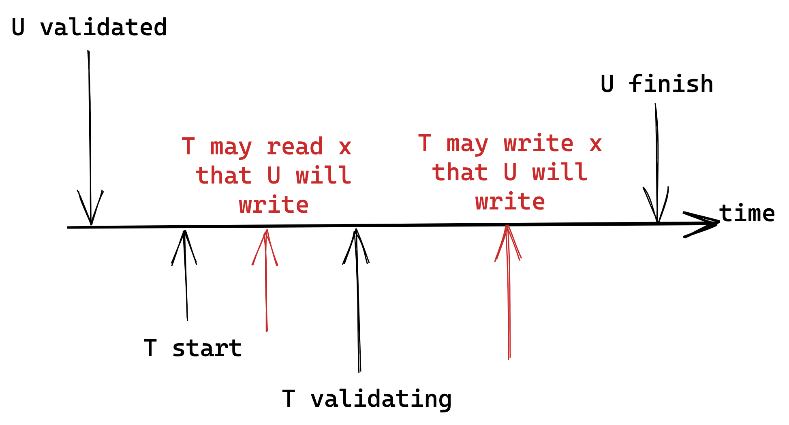

--

.red[
$$WS(U) \cap RS(T) = \emptyset \ and \ WS(U) \cap WS(T) = \emptyset$$
]

---

layout: false
## Summery of TO and OCC

- TO and OCC:

  - works best when the number of conflicts is low

  - timestamp allocation bottleneck

  - long running transactions can get starved

- OCC

  - high overhead for copying data into the private workspace

  - validation/write phase bottlenecks

  - aborts are potentially more wasteful

???
TODO:
OCC TO 的优缺点
更多 OCC 例子
OCC 更加形式化的表达
???

---

layout: false
## Multi-Version Concurrency Control

With MVCC, the system maintains multiple physical versions of a single logical object:

- $w(x)$ creates a new version of $x$.
- $r(x)$ reads the **newest** version of $x$ that existed when the transaction started.

$X$ 表示 $x$ 数据项的所有版本:
  - $X = \\{x_1, ..., x_i, ..., x_n\\}$
  - $WT(x_{i-1}) \le WT(x_i)$

---

layout: true

## MVTO

---

.center[**MVTO  = MVCC + Timestamp Ordering**]

---

### Reads

对于事务 T 中的 $r(x)$:

- 从 $X$ 中找到最大的 $j$，使得 $WT(x_j) \lt TS(T)$:

  - $RT(x_j)=max(RT(x_j),\ TS(T))$，

  - 返回 $x_j$ 作为 $r(x)$ 的结果。

---

### Writes

对于事务 T 中的 $w(x)$:

- 从 $X$ 中找到最大的 $j$，使得 $WT(x_j) \lt TS(T)$
  - 如果 $RT(x_j) > TS(T)$：abort and restart T。
  - otherwise：
      - 创建 $x$ 的新版本 $x_{j+1}$，并插入 $j$ 之后。
      - $WT(x_{j+1}) = TS(T)$。

---

### Example #5

$TS(T) = 1 \ \ TS(U) = 2$

.left-grid[
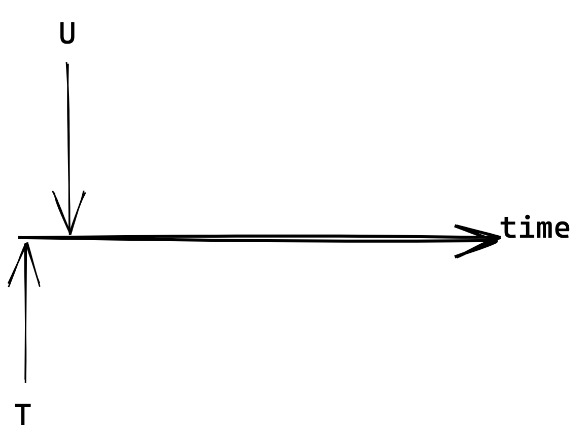
]

.right-grid[
| Version | Value | WT  | RT  |
| ------- | ----- | --- | --- |
| $x_1$   | 10    | 0   | 0   |
]

---

### Example #5

$TS(T) = 1 \ \ TS(U) = 2$

.left-grid[
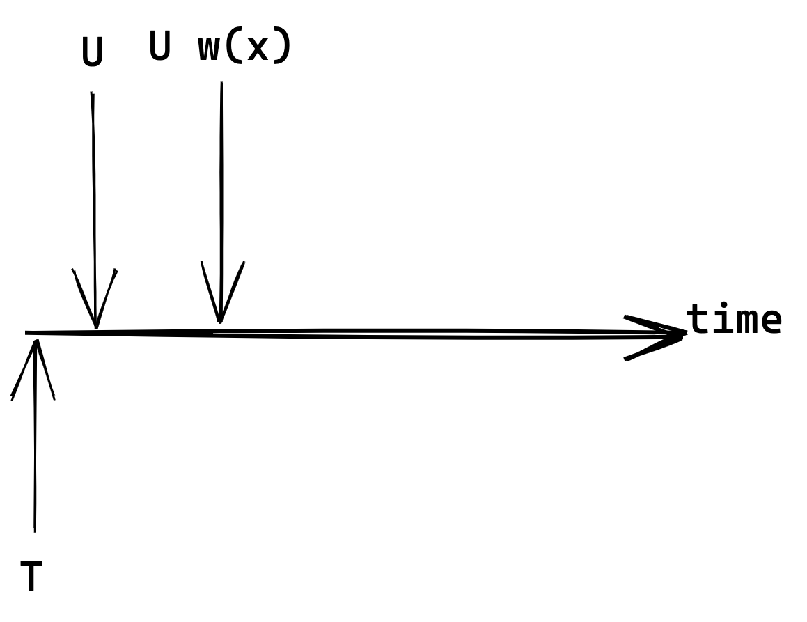
]
.right-grid[
| Version     | Value    | WT      | RT      |
| ----------- | -------- | ------- | ------- |
| $x_1$       | 10       | 0       | 0       |
| .red[$x_2$] | .red[20] | .red[2] | .red[-] |
]

---

### Example #5

$TS(T) = 1 \ \ TS(U) = 2$

.left-grid[
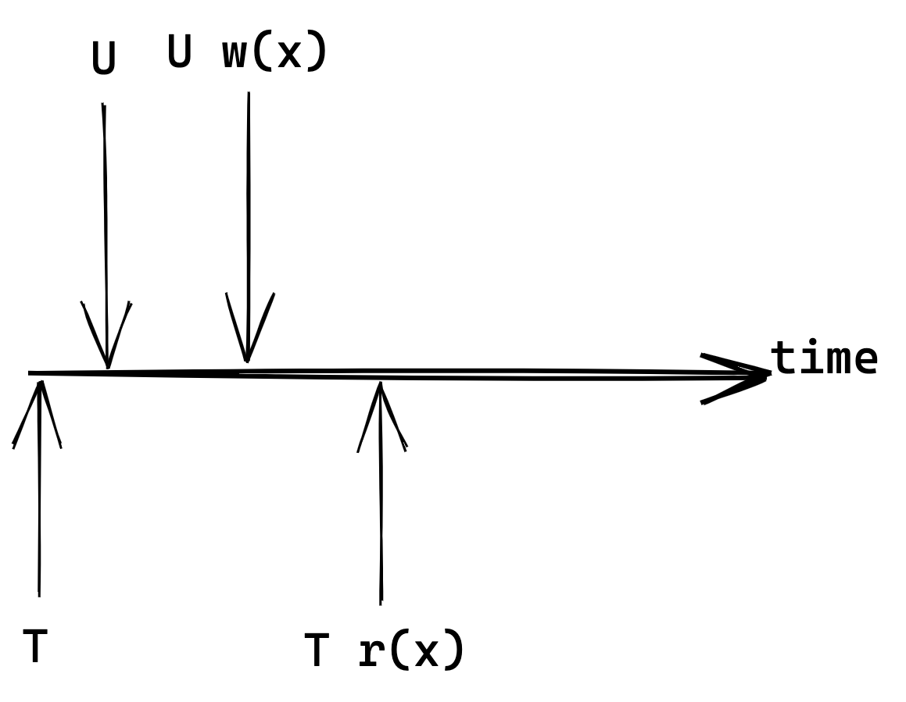
]

.right-grid[
| Version | Value | WT  | RT      |
| ------- | ----- | --- | ------- |
| $x_1$   | 10    | 0   | .red[1] |
| $x_2$   | 20    | 2   | -       |
]

---

### Example #5

$TS(T) = 1 \ \ TS(U) = 2$

.left-grid[
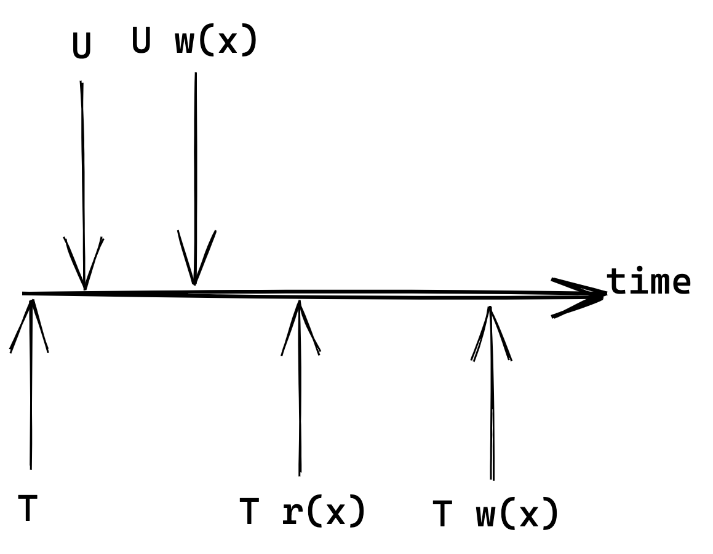
]

.right-grid[
| Version        | Value   | WT      | RT  |
| -------------- | ------- | ------- | --- |
| $x_1$          | 10      | 0       | 1   |
| .orange[$x_3$] | 20      | 2       | -   |
| .red[$x_2$ ]   | .red[0] | .red[1] | -   |
]

---

layout: false
### Summery of MVCC

- writers do not block writers and readers do not block readers

- read-only transactions can read a consistent snapshot of the database without using locks of any kind

- multi-versioned DBMSs can easily support time-travel queries,
