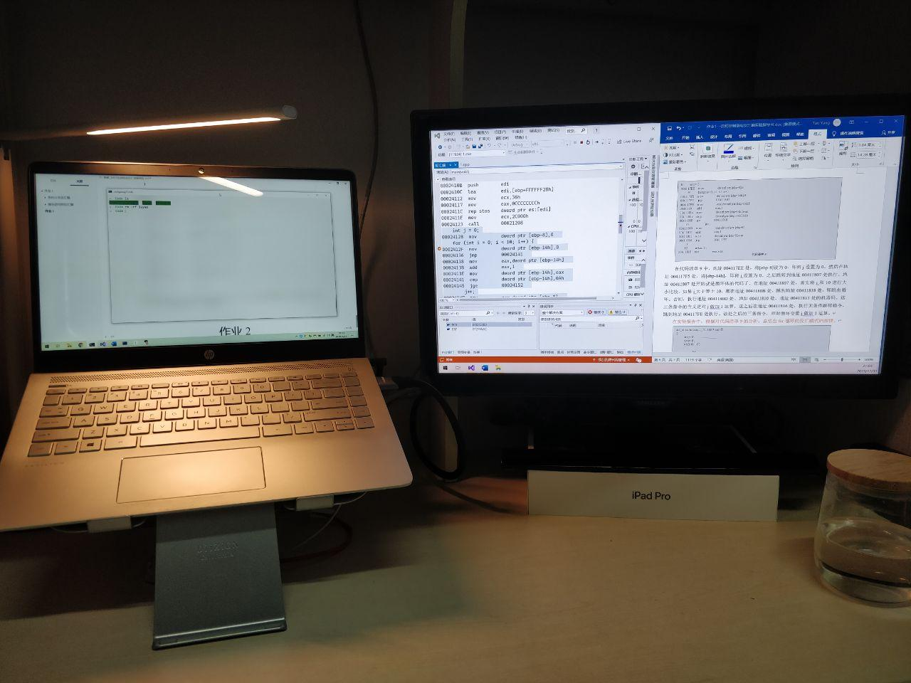

21 世纪的 10 年代就这么结束了。过得好快，好像什么也没有做过一年就完了，回头看看似乎还是做了不少的事。

## 跑步

~~去年~~ 2018 年开始练习并爱上跑步（还没有切换过来🤣），但是 2018 年太懒了，跑得太少，更谈不上练习。2019 年算是开始认真练习的第一年吧。大概是 6 月份的时候买了 Amazifit 的手表，之后跑步的都是用手表记录了。2019 年总共可能跑了有 250 km，这个距离不算长，还不能从成都跑回我家呢。但是我还是挺满意的，毕竟我开始了，开始了认真的练习。

 

先来一张马拉松的奖牌合影（我好像除了马拉松就没有别的什么奖牌了😅）。

今年第一场马拉松是“金温江马拉松 10 km”，算是我第一次参加比较正式的马拉松吧。

比赛的前几天一直下着大雨，还夹杂这不小的风，我去领参赛包的时候全身都湿透了。我还担心跑步那天也会下雨。幸运的是，比赛那天风和日丽，虽然跑到后面太阳有一点点晒。这其实是我第一次跑 10 km，平时练习跑步都只会跑 5 km。跑前还担心自己会跑不下来，结果成绩还不错，净成绩：46 分 36 秒。

这次马拉松给了我不少信心，之前觉得自己只能自己跑着玩玩，从来没有想到我还能跑出不错的成绩（其实很一般的成绩，只是我很满意啦）。

6 月份有一次校园马拉松，5 km。但是那天状态不好，跑到一半的时候肚子疼，最后成绩：25 分 47 秒。

2019 银杏节校园马拉松，我参加了 10 km。我觉得校园马拉松的总长度不止 10 km，我的手表测出来大概有 11 km。最后成绩：48 分 48 秒。全校排第 12 名，我还是比较满意了。

希望今年再接再厉，争取上半年跑一次半马，后半年参加一次全马。我觉得自己现在还是太瘦弱了，很多关键肌肉还没有练好，要完成这个目标还要很多的练习。今年要制定更加具体的练习计划，增加练习量，科学练习。期待今年在跑步方面取得更好的成绩。

我一直在想为什么我喜欢上了跑步。最开始跑步是因为 2018 年有段时间太丧了，希望可以通过跑步让自己振作一些。在昏黄的路灯和惨淡的月光的见证下，我不知道绕着学校的环湖跑道跑了多少圈。湖水泛出的鱼腥味，刚割过的草坪的味道，有时还有刚开出的花的清香，夹杂在一起，就和我当时心境一样复杂，分不清是好闻还是臭。跑完步，衣服已经被汗水浸湿，身体也疲惫不堪，心情该怎样丧还是怎样丧。我不觉得跑步陪我走过了那段不开心的时光。但是我还是喜欢上了跑步。喜欢每一次脚与地面的亲密接触，喜欢急促的呼吸，也喜欢那种不断移动的感觉。

我觉得我喜欢跑步，村上的影响也很大。尤其是他在《我的职业是小说家》和《当我在谈跑步的时候我在谈什么》讲述他与跑步的故事，对我影响尤其大。正好从跑步的话题换到读书。

## 读书

上了大学之后开始大量读书也是 2018 年，2019 年当然读了更多的书。

2019 年，我读的大多数都是小说，对村上的喜欢还是很坚定。2019 的书单中有很多是他的书，还有很多是他提到过的书。

先说村上。2019 年，读了 6 本村上的小说，一本访谈，一本随笔，一本短篇集。我觉得今年读到的最好的是《奇鸟行状录》，情节复杂，内涵丰富，还是村上特有的风格。一言两语说不清这本书，总之我觉得它可能是村上最好的作品吧，已经很接近《卡拉马夫兄弟》了（私以为）。最让我惊喜的是前段时间刚读完的《寻羊冒险记》，可以很明显地看出从《且听风吟》，《1973年的弹子球》之后，村上的创作开始变得成熟。这本书剧情第一次变得有些复杂了，而且这书很有钱德勒的味道。

2019年我读到的最优秀的作品——《卡拉马夫兄弟》。这本书最让我震撼的是作者描绘了人性的全部深度，不愧鲁迅说的“人类灵魂的伟大的审问者”（这话鲁迅真说过）。除了对人性的深刻剖析，这本书中对宗教，信仰，俄罗斯社会的讨论也相当精彩。我认为这是我迄今为止读到的最好的作品吧。谢谢村上荐书，哈哈~。

2019 年最让我感到惊喜的作品——《别让我走》。这本书还是村上推荐的，哈哈～。读这本书有一种让我找回了童年时期读书的那种感受。童年读书是什么感受呢：跟着主人公一起笑，一起哭，感动他（她）的感动，悲伤他（她）的悲伤。这本书给我很强的代入感，温柔却又残忍。书的结构也很有趣，像一个洋葱一样，一层一层地剥开，非常有趣。

2019 年，我读到的最佳的非虚构类作品是史铁生的《病隙碎笔》。这本书零碎地记录了作者各种感想，关于宗教，社会，人生，爱情等等，内容零碎但是思想深刻。作者在其中大谈天堂，有限与无限，还有读自身和社会深刻的反思，不禁让人感叹身体残缺的人思想比不少健全的人健全的多。

2019 年又重读了一遍《Norwegian Wood》，这次读的是英文版。每一次读都很感动吧，大概以后这本书是我的必修吧，每年都会拿出来读一读。读了不少书，渐渐发现了很多比《挪威的森林》优秀的书，但是一点也没有冲淡我对她的喜欢啊。可能就像爱一个人那种感觉，虽然看到了更多漂亮的女孩，但是还是喜欢那一个和我心灵契合的人。

2019 年唯一的遗憾就是非虚构类读的还是少了些，希望今年多安排一些非虚构类书籍吧。

## 写代码

这个 Github 的年度报告不准确，我怎么可能只写了这么一些代码。

2019 年最让我心烦的就是代码问题了。感觉自己做了很多无用工，写了很多没有用但是又不得不写的代码。不过应该还是有很多看不到的提升吧，毕竟累计了这么多的量。

今年写代码还有专业上应该好好计划了，少做些没有用的东西，毕竟大学时间已经不多了。

喜欢今年 Github 的贡献记录上，我是一片“绿”，哈哈。

## 找寻

2019 对我来说是找寻的一年。我开始尝试各种各样的新事物，认识新的朋友，做以前不喜欢的事。怎么说好呢？感觉自己的心境变地开阔了。以前是在峡谷之中，只看得到头顶上一条缝的天空。现在我在开阔的大草原上，一望无际的草坪在远处和蓝天交连。从前在峡谷中，我只能一股老地往前冲，现在我看到了无限的可能，四面八方都是美好的风景。

在峡谷中前进，我不需要考虑方向，但是现在我要考虑方向了。我开始思考很多以前没有怎么想过的问题。比如人生的意义。很多问题都没有想通，但是好像世界上也没有几个人能真正想通吧。这个思考的过程像是找寻的过程。这个寻找可能也是我一辈子的寻找吧，没有终点，彼岸的彼岸仍然是彼岸。人活着或许就应该找寻些什么吧，比如《寻羊冒险记》中的羊博士一直找寻这羊，即便是最终没有找到还是要不断地找下去。

我喜欢这种找寻什么的感觉，有一种在路上的感觉。虽然不知道有没有终点，也不知道方向是否正确，但是仅仅是这种找寻的感觉就能给我无限的踏实感。

## 放弃

记得小学的时候写一篇半命题作文：“我选择...”，我当时写的是“我选择放弃”。老师说这篇作文在老师改卷的时候备受好评，之后还在全班读了这篇作文。现在才明白当时那个小屁孩写的放弃是多么的泛泛之论，说的多么轻松。
如今，我真的选择了一次放弃。如今才知道当天轻轻谈起的“放弃”，是多么的艰难，是需要多大的勇气。真的放弃是很痛的吧。不过我都接受了。我不能站在原地，看着整个世界都在往前走，而我却停滞不前吧。我得勇敢地向前啊！谁也不知道，我是积累了多少的勇气才能选择放弃。放弃在别人看来大概都是做选择吧。

在 2019 年的年末，我选择了放弃；选择不再安于现状、委屈求全；选择承认自己浪费了两年的青春；选择勇敢地去拥抱自己的未来。

---

最后用一首最近很喜欢的诗来结束吧。

>去什么地方呢？这么晚了，
>
> 美丽的火车，孤独的火车？
>
> 凄苦是你汽笛的声音，
>
> 令人记起了许多事情。
>
> 为什么我不该挥舞手巾呢？
>
> 乘客多少都跟我有亲。
>
> 去吧，但愿你一路平安，
>
> 桥都坚固，隧道都光明。

喜欢这种踏实的感觉。喜欢夏日的光照，风的气息，蝉的鸣叫，喜欢这些，喜欢得不得了。对了，不喜欢你喝的啤酒。哈哈。

希望 2020 的桥都坚固，隧道都光明。
